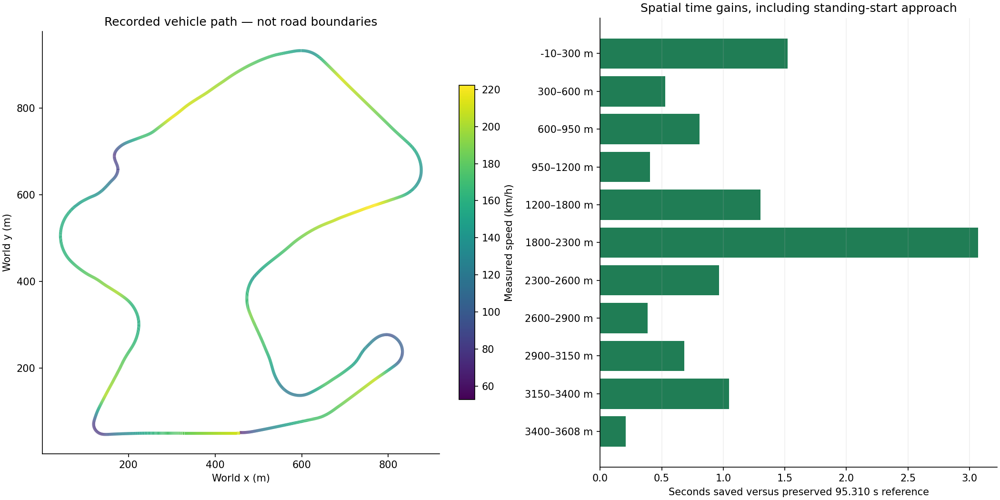

# ATLAS — Adaptive Track-Line Autonomous System

A measured, map-aware racing controller for the IBM SkillsBuild TORCS challenge:
the fastest valid **standing-start lap of Corkscrew**, using **scr_server 1** and
the prescribed car and livery.

**Sense → map → plan → control → measure → falsify → improve.**

## Qualified performance

| Checkpoint | Official lap (s) | Evidence level |
|---|---:|---|
| Telemetry baseline | 252.856 | Audited historical |
| Mapped reference | 95.310 | Repeated reference |
| Spatial candidate | 89.394 | Timing + GUI |
| ATLAS RC1 | 84.388 | Timing + GUI |


Selected evidence: **ATLAS RC1**, **84.388 s**, 9 timing repeats
plus a normal GUI reproduction with the identical sensor/action trajectory.
Peak speed **222.248 km/h**; maximum **|trackPos| 0.583837**; damage **0**.
These are measurements under the documented local validity gate, not an
organizer-issued certification. Experimental improvements are never substituted
for qualified results.



## How it drives

A telemetry-derived curvature map locates each turn by distance. The planner
builds a curvature-limited speed envelope and propagates braking constraints
backward. Spatial line targets guide heading and lateral-position feedback;
curvature feedforward and steering-rate limits anticipate the road. Wheel-speed
feedback manages traction and braking, and a simulation-time clutch regulator
handles the standing start. The selected controller does not use a forward
acceleration pass: tested additions must earn their place through valid lap time.

Live sensors anchor the plan. Knowledge of the fixed circuit does not replace
feedback. Car-model dynamics, track geometry and simulator physics are untouched.
See [architecture](docs/ARCHITECTURE.md) and [recorded controls](evidence/controls.png).

## How it was engineered

Accelerated headless TORCS screened hypotheses cheaply. Each retained experiment
bound parameters and source hashes to complete sensor/action evidence. Spatial
lap deltas identified where time was gained or lost. Invalid laps and rejected
hypotheses were retained locally rather than promoted as records.

The engineering ladder separates single exploratory laps, repeated headless
confirmation, and expensive timing/GUI qualification. A later Frontier probe
tested smooth line interpolation and forward acceleration planning in ten runs;
it produced no challenger to RC1. This repository contains the qualified racer
and representative audit evidence, not the raw experimental laboratory.

## Timing is part of correctness

SCR has an approximately 10 ms response deadline. A late response can hold the
previous action and subsequently be consumed against a newer sensor state.
An apparent controller instability was traced to blocking logging and startup
work. Telemetry now runs in a separate warmed process; cyclic GC is deferred
during the exchange; model loading and filesystem work occur before identification
or after teardown. The control loop sends its command before enqueueing telemetry.

Qualification covers ordinary operation, an added 3 ms response delay, and seeded
sampling of measured GUI response jitter. See [timing evidence](docs/TIMING.md)
and the [machine-readable qualification](evidence/qualification.json).

## Reproduce

The driving client and offline checks use the Python standard library.
Use Python 3.10 or later; Python 3.10 is the measured simulator environment.

```sh
python qualify_atlas.py --offline
```

In the supplied Linux TORCS/SCR environment, configure Corkscrew, scr_server 1,
standing start and the original approved car/livery. Launch the client before
starting the GUI race:

```sh
python competition_client.py --params atlas_params.json
```

The full race qualification requires the compatible installed simulator and its
asset hashes. It is deliberately excluded from cloud CI:

```sh
python qualify_atlas.py --params atlas_params.json --gui-run experiments/GUI_RUN_ID
```

Detailed [setup and reproduction](docs/REPRODUCTION.md) explains the GUI evidence
step and measured paths. `torcs_jm_par.py` retains a historical reference default;
use `competition_client.py` for the selected ATLAS candidate.

## Evidence and release identity

| Artifact | SHA-256 |
|---|---|
| `atlas_controller.py` | `3f04a590c1ce72d1ff29adb6b4dd73a6bd649eac31ce3764e25ce7fa59784be5` |
| `atlas_params.json` | `c6ac84014112edc203db0c5995e439a78af07137601ea3152bb9cedb6cad72a9` |
| `track_model.json` | `eea1b611a1d99a8921140abe4568e7985e2e0c6f726c7b62c151d5145294917f` |


The six selected trace fixtures support exact offline command replay, historical
comparison, GUI timing resampling and the selected benchmark. Their purpose is
listed in [the fixture inventory](evidence/fixture_inventory.json).

`python tools/generate_release.py` verifies selected source hashes and generates
this README plus `dist/submission_manifest.json`. The manifest records the Git
revision at generation time. Final video: **pending — not submission-complete**.

The release is not submission-complete until the
[submission-readiness checklist](docs/SUBMISSION_READINESS.md) is satisfied.
The packaged livery is an unchanged copy of the locally qualified asset; its
exact organizer-required identity still needs confirmation between two bundled
car/livery pairs. IBM explicitly requires public livery inclusion for this entry;
see [provenance](docs/LIVERY_PROVENANCE.md).

## Credits and license

ATLAS builds on Gym-TORCS and the SCR Python client lineage. Existing notices
are preserved. See [LICENSE](LICENSE) and [third-party notices](NOTICE.md).
The code license is not asserted to cover the livery or the separately installed
TORCS simulator and car assets.
